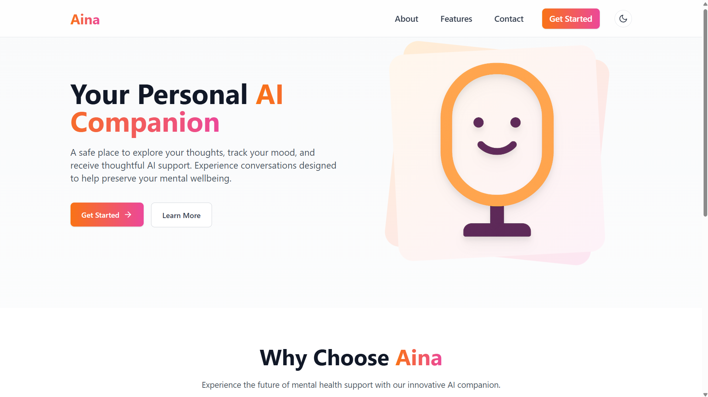
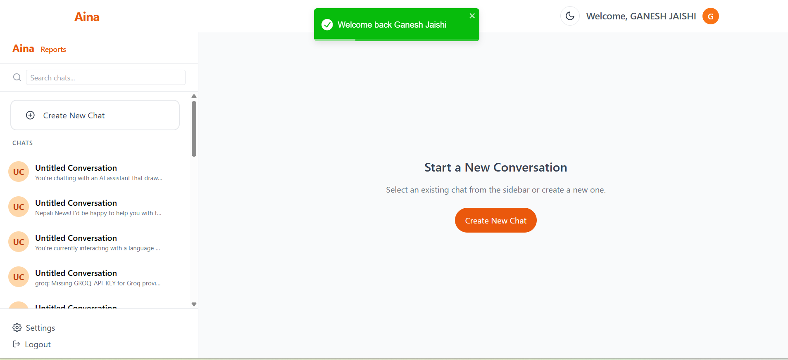
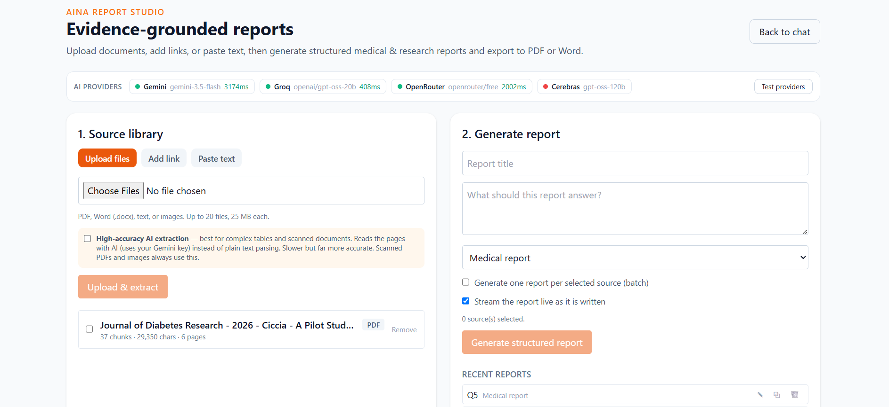
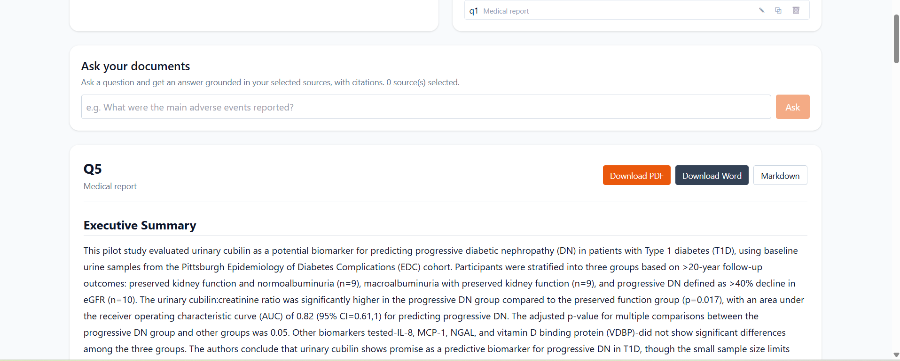

# AINA

**AINA** is a full-stack AI platform that pairs a supportive conversational **wellness companion** with **Report Studio** — an evidence-grounded engine for analysing medical reports and scientific papers and turning them into structured, cited reports.

It is built on the MERN stack (MongoDB, Express, React, Node.js) with a resilient multi-provider AI layer, semantic retrieval (RAG), and AI-powered document reading that handles complex tables and scanned documents.

> **Disclaimer:** AINA is a supportive and analytical tool, not a substitute for professional medical or mental-health care. The wellness companion offers non-medical, supportive conversation only. Report Studio produces analytical summaries of source documents and does not provide diagnosis or treatment. Always verify clinical and scientific claims against the cited sources and consult a qualified professional.

---

## Overview

AINA has two pillars that share one authentication system, database, and AI provider layer:

- **Aina Chat** — a conversational wellness companion offering supportive, non-medical dialogue with saved history, secure sign-in, and voice-friendly interaction.
- **Report Studio** — a pipeline that ingests documents (upload, link, paste, or image), reads them accurately, retrieves the most relevant evidence, and generates structured medical and research reports that can be exported as PDF or Word.

---

## Screenshots

**Aina — conversational wellness companion**

| Landing | Conversation |
| --- | --- |
|  |  |

**Report Studio — evidence-grounded medical & research reports**

| Report Studio &amp; live provider pool | Generated report |
| --- | --- |
|  |  |

---

## Features

### Report Studio

- **Multimodal ingestion** — upload PDF, Word, and text files; paste text; add a web link (article or PDF); upload images; or batch many sources at once.
- **AI document extraction** — a multimodal model reads pages as images to perform OCR on scanned documents and to reconstruct complex tables that plain-text parsing flattens. The full mechanically-extracted text is combined with cleanly structured, AI-extracted tables for the best of both.
- **Semantic retrieval (RAG)** — passages are embedded and ranked by meaning, so a query about a "heart attack" matches a passage on "myocardial infarction". An adaptive strategy feeds the whole document to the model when it fits, and falls back to semantic selection for large corpora.
- **Structured templates** — Medical Report, Research Paper Analysis, Literature Synthesis, Executive Brief, and a general-purpose template, each with domain-appropriate sections and evidence-grounding instructions.
- **Ask your documents** — ask a question and get an answer drawn strictly from your selected sources, with citations.
- **Streaming generation** — watch a report write itself progressively.
- **Citations & traceability** — every report records the exact passages used to ground it.
- **Report management** — rename, duplicate, and delete past reports.
- **Professional export** — download reports as PDF, Word (.docx), HTML, or Markdown.

### Multi-provider AI layer

- **Provider pool** — Google Gemini, Groq, Cerebras, and OpenRouter behind one common interface, with per-provider models configurable via environment variables.
- **Load-balancing & failover** — requests rotate across providers and automatically fail over on error or rate-limit.
- **Parallel batch** — batch report generation runs in parallel, one lane per provider.
- **Automatic retry** — transient rate-limit and service-unavailable responses are retried with backoff.
- **Live status** — a health-check endpoint and an in-app status strip show which providers are online and their latency.

### Conversational wellness companion

- Supportive, non-medical AI conversation with persisted, per-user history and editable titles.
- Browser-based speech-to-text input and text-to-speech read-aloud for accessibility.
- Lightweight, private mood check-ins.

### Platform & security

- Email/password authentication with bcrypt hashing and JWT-protected APIs.
- Optional Google OAuth 2.0 sign-in via Passport.
- Hardened server: security headers (Helmet), request logging, two-tier rate limiting, centralised error handling, and a health-check endpoint.
- Per-user data isolation — sources and reports are scoped to their owner.

---

## Tech stack

**Frontend:** React 19, Vite, Tailwind CSS, Redux Toolkit, React Router, Framer Motion, Axios, marked, DOMPurify, React Speech Recognition

**Backend:** Node.js, Express 5, Mongoose, Passport, JWT, bcrypt, Helmet, express-rate-limit, Morgan, Multer

**Document processing:** pdf-parse, Mammoth (DOCX), Readability + jsdom (web articles), pdfmake (PDF export), html-to-docx (Word export)

**AI:** Google Gemini (generation, embeddings, and vision extraction), Groq, Cerebras, OpenRouter; retrieval-augmented generation with vector embeddings

---

## Architecture

```text
React + Vite client
        |
        |  HTTPS / REST (Axios + JWT)
        v
Express API  ──  Auth (bcrypt, JWT, Google OAuth)
        |
        |-- Chat service ─────────────┐
        |-- Report Studio             │
        |     ├─ Extraction (pdf-parse + AI vision: OCR & tables)
        |     ├─ Embeddings + semantic retrieval (RAG)
        |     ├─ Templates (medical / research / ...)
        |     ├─ Export (PDF / Word / HTML / Markdown)
        |     └─ Ask · Streaming · Citations
        |                             │
        └-- AI provider pool ◄────────┘
              Gemini → Groq → OpenRouter → Cerebras
              (load-balanced, failover, retry)
        |
        v
   MongoDB (users, conversations, sources, reports)
```

---

## Getting started

### Prerequisites

- Node.js 18+ and npm
- A MongoDB connection string (local or Atlas)
- At least one AI provider API key (Google Gemini recommended as the primary)

### 1. Clone and install

```bash
git clone https://github.com/ganesh-234/AINA.git
cd AINA

cd backend  && npm install
cd ../frontend && npm install
```

### 2. Configure environment variables

Create `backend/.env.local` from the template and fill in your own values:

```bash
cd ../backend
cp .env.example .env.local
```

Key backend variables (see `.env.example` for the full list):

```env
# Core
MONGO_URI=your_mongodb_connection_string
JWT_SECRET=replace_with_a_long_random_secret
SESSION_SECRET=replace_with_a_different_long_random_secret
CLIENT_ORIGIN=http://localhost:5173

# AI provider pool (rotation order; only configured providers are used)
LLM_POOL=gemini,groq,openrouter,cerebras
REPORT_PREFER_PROVIDER=gemini

GEMINI_API_KEY=your_gemini_key
GEMINI_MODEL=gemini-3.5-flash
GROQ_API_KEY=your_groq_key
GROQ_MODEL=llama-3.3-70b-versatile
OPENROUTER_API_KEY=your_openrouter_key
OPENROUTER_MODEL=openrouter/free
CEREBRAS_API_KEY=your_cerebras_key
CEREBRAS_MODEL=gpt-oss-120b

# Retrieval (RAG) and AI document extraction
EMBED_POOL=gemini,openrouter
GEMINI_EMBED_MODEL=gemini-embedding-001
EMBED_DIMS=768
GEMINI_EXTRACT_MODEL=gemini-3.5-flash

# Optional: Google OAuth
GOOGLE_CLIENT_ID=your_google_client_id
GOOGLE_CLIENT_SECRET=your_google_client_secret
GOOGLE_REDIRECT_URI=http://localhost:5000/api/auth/google/callback
```

Create `frontend/.env.local`:

```env
VITE_SERVER_URL=http://localhost:5000
```

> **Never commit `.env.local`.** It is excluded by `.gitignore`. Only `.env.example` (placeholders) is tracked.

### 3. Run

```bash
# Terminal 1 — API
cd backend && npm start

# Terminal 2 — client
cd frontend && npm run dev
```

Open the URL Vite prints (usually `http://localhost:5173`). Report Studio is at `/reports`.

---

## Environment variables

| Variable | Purpose |
| --- | --- |
| `MONGO_URI` | MongoDB connection string |
| `JWT_SECRET`, `SESSION_SECRET` | Auth and session secrets |
| `CLIENT_ORIGIN` | Allowed CORS origin for the client |
| `LLM_POOL` | Provider rotation order for generation |
| `REPORT_PREFER_PROVIDER` | Preferred provider for report generation |
| `GEMINI_API_KEY` / `GEMINI_MODEL` | Google Gemini (primary generation) |
| `GROQ_API_KEY` / `GROQ_MODEL` | Groq |
| `OPENROUTER_API_KEY` / `OPENROUTER_MODEL` | OpenRouter (auto free-model routing) |
| `CEREBRAS_API_KEY` / `CEREBRAS_MODEL` | Cerebras |
| `EMBED_POOL`, `GEMINI_EMBED_MODEL`, `EMBED_DIMS` | Semantic retrieval (RAG) |
| `GEMINI_EXTRACT_MODEL` | AI document extraction (OCR & tables) |
| `GEN_RATE_MAX`, `API_RATE_MAX` | Rate limits |
| `GOOGLE_CLIENT_ID` / `GOOGLE_CLIENT_SECRET` / `GOOGLE_REDIRECT_URI` | Optional Google OAuth |

Model names change over time; because each provider's model is configurable, you can update them here without touching code.

---

## Project structure

```text
AINA/
├─ backend/
│  ├─ config/            # db and passport setup
│  ├─ controllers/       # auth, chat, and report controllers
│  ├─ middlewares/       # JWT auth
│  ├─ models/            # User, Conversation, Source, Report
│  ├─ routes/            # auth, chat, report routes
│  ├─ services/
│  │  ├─ llmService.js       # multi-provider pool, streaming, retry
│  │  ├─ embeddingService.js # RAG embeddings
│  │  ├─ extractService.js   # PDF/DOCX/URL + AI vision extraction
│  │  ├─ exportService.js    # PDF / DOCX / HTML export
│  │  └─ reportTemplates.js  # structured report templates
│  └─ server.js          # hardened Express app
└─ frontend/
   └─ src/
      ├─ pages/          # Home, AinaChat, ReportStudio, ...
      ├─ components/     # chat UI, navbar, theming
      └─ store/          # Redux store
```

---

## Security & privacy

- Secrets, database strings, OAuth credentials, and local environment files are excluded by `.gitignore`.
- Passwords are hashed with bcrypt; JWTs protect authenticated API requests.
- CORS is restricted to the configured client origin; security headers and rate limiting are applied server-side.
- Conversations, sources, and reports are scoped to their owner.

Before deploying, use strong unique secrets, restrict OAuth redirect URIs, set production CORS origins, and store provider keys in your host's environment-variable settings rather than in any committed file.

---

## Roadmap

- A re-ranking stage on top of semantic retrieval
- Optional paid provider tier for guaranteed availability of the most capable models
- An automated test suite in the repository
- Additional safeguards on ingested document text against prompt-injection

---

## License

Released under the [MIT License](LICENSE). © 2026 Ganesh Jaishi.
